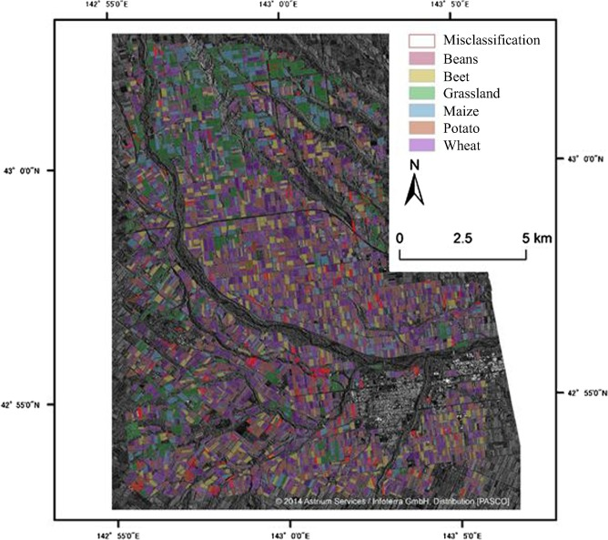

# What are TerraSAR-X and TanDEM-X

.pull-left[
  
- TanDEM-X is a German radar satellite from DLR (the German Aerospace Center).


- TerraSAR-X launched in 2007 and was joined by TanDEM-X in 2010. Both satellites remain operational.


- They lie in tight formation and can image the Earth's topography from different angles.

- They have unprecedented accuracy for research, development, and scientific and commercial applications.
]


.pull-right[

```{r echo=FALSE, out.width='80%'}

```
<small> Fig.1.TerraSAR-X. Source: [Earth Oline](https://earth.esa.int/eogateway/documents/20142/2205524/TerraSAR-X.jpg)
</small>

```{r echo=FALSE, out.width='80%'}

```
<small>Table.1.The Parameters of Sentors. Source: [Earth Oline](https://earth.esa.int/eogateway/missions/terrasar-x-and-tandem-x)
] 
</small>

---
# The Parameters


  
- The primary payload of the TerraSAR-X and TanDEM-X satellites is an X-band radar sensor that can acquire images with different swath widths, resolutions, and polarisations.


- The SAR instrument has "bar graph", "spotlight" and "scanning SAR" modes of operation, allowing high-resolution images and wide-angle images to be obtained.


```{r echo=FALSE, out.width='100%', fig.align='center'}

```

.center[ <small> Table.2.The parameters.Source: [Earth Oline](https://earth.esa.int/eogateway/missions/terrasar-x-and-tandem-x) </small>]

---
# The Most Outstanding Function


- TanDEM-X produces a consistent global Digital Elevation Model (DEM) with unprecedented accuracy that exceeds the HRTI-3 specification. 


- They provide a highly reconfigurable platform for demonstrating new radar imaging technologies and applications.

- Key elements are bistatic data acquisition using an innovative phase-synchronous link, a novel satellite formation flight concept.
 - Allowing bistatic data acquisition with a short along-track baseline.
 - A new interferometric mode for system validation and DEM calibration.

 


```{r echo=FALSE, out.width='70%', fig.align='center'}

```
.center[<small> Fig.2.Pursuit monostatic mode for TanDEM-X data acquisition. Source: [ScienceDirect](a consistent global digital elevation model (DEM))
</small>]


 
 
---
# Case Study: Discrimination of Crop Types

.pull-left[
  
-  Crop distribution map of Hokkaido, Japan, using TerraSAR-X (including TanDEM-X) dual polarisation data.


-  The classification was performed using TerraSAR-X-derived information.


- The high sensitivity of gamma nought to crop height was demonstrated statistically for beans, beet and maize. 

]


.pull-right[

```{r echo=FALSE, out.width='100%'}

```
.center[<small>Fig.3.Crop classification map. Source: [ScienceDirect](https://ars.els-cdn.com/content/image/1-s2.0-S1474706514000679-gr12.jpg)</small>]
]

---
# Case Study: Evaluation of DEM Generation

.pull-left[
  
-   The TanDEM-X DEM was evaluated and compared with global and regional DEM's.


-  The vertical accuracy of TanDEM-X was much higher than that of the existing global DEM.


- TanDEM-X data has excellent potential for flood inundation studies with sea level rise.

]


.pull-right[

```{r echo=FALSE, out.width='65%',fig.align='center'}

```
.center[<small>Fig.4.TanDEM-X Based Classified DEM. Source: [ScienceDirect](https://ars.els-cdn.com/content/image/1-s2.0-S1474706515000807-gr4.jpg)</small>]
]


---
# Case Study: Coastline Detection

.pull-left[
  
- An unsupervised shoreline detection procedure is proposed based on scale-space representation, K-medians clustering, and morphological image post-processing.

- The use of SAR amplitudes and the apparent discriminability of 'dark' and 'light' water and land surfaces in coherent images.

]


.pull-right[

```{r echo=FALSE, out.width='80%'}

```
.center[<small>Fig.5.Comparison of coherence estimates (a) amplitude, (b) boxcar estimate, and (c) nonlocal estimate. .Source: [ScienceDirect](https://ars.els-cdn.com/content/image/1-s2.0-S092427161830340X-gr4.jpg)</small>]
]

- Non-local filtering improves the achievable shoreline extraction accuracy relative to conventional box filtering. 
 
 - This benefit occurs mainly in inhomogeneous areas close to the actual shoreline.


---
# Summary
- The novel satellite formation flight concept allows the collection of double base data along the orbital baseline, which can generate a consistent global digital elevation model (DEM) with high accuracy.

- SAR data can be used to monitor changes and phenomena on the ocean surface and underwater. For example, SAR data can be used to monitor oil pollution in the ocean, marine ecology, sea ice distribution, etc.

- SAR data can be used to monitor the natural environment and natural disasters, such as earthquakes, floods, landslides, forest fires, etc.

---
# Reflections
## Important applications
- Earth observation: can monitor changes and phenomena on the Earth's surface, such as sea level rise, glacial melt, land use changes, etc.

- Smart agriculture: can be used for monitoring and management of agricultural production, e.g. monitoring crop growth, land use changes, 

## Research trends
- Research on high-precision remote sensing data processing algorithms, including data denoising, deformation analysis, model fitting, etc.

- Intelligent processing and analysis techniques of remote sensing data, including the application of machine learning, artificial intelligence and other processes in the remote sensing data processing.


---
# Reference

Avtar, R. et al. (2015) ‘Evaluation of DEM generation based on Interferometric SAR using TanDEM-X data in Tokyo’, Physics and Chemistry of the Earth, Parts A/B/C, 83–84, pp. 166–177. Available at: https://doi.org/10.1016/j.pce.2015.07.007.

Krieger, G. et al. (2007) ‘TanDEM-X: A Satellite Formation for High-Resolution SAR Interferometry’, IEEE Transactions on Geoscience and Remote Sensing, 45(11), pp. 3317–3341. Available at: https://doi.org/10.1109/TGRS.2007.900693.

Schmitt, M., Baier, G. and Zhu, X.X. (2019) ‘Potential of nonlocally filtered pursuit monostatic TanDEM-X data for coastline detection’, ISPRS Journal of Photogrammetry and Remote Sensing, 148, pp. 130–141. Available at: https://doi.org/10.1016/j.isprsjprs.2018.12.007.

Sonobe, R. et al. (2015) ‘Discrimination of crop types with TerraSAR-X-derived information’, Physics and Chemistry of the Earth, Parts A/B/C, 83–84, pp. 2–13. Available at: https://doi.org/10.1016/j.pce.2014.11.001.

TerraSAR-X and TanDEM-X - Earth Online (no date). Available at: https://earth.esa.int/eogateway/missions/terrasar-x-and-tandem-x (Accessed: 4 March 2023).


